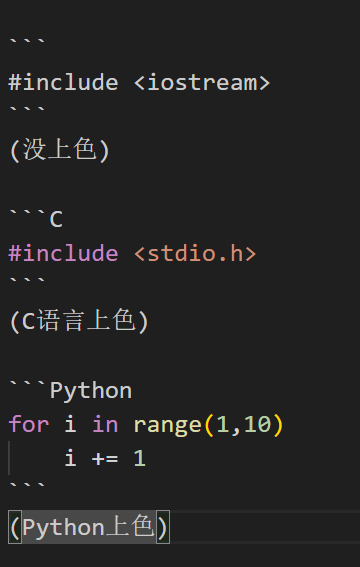
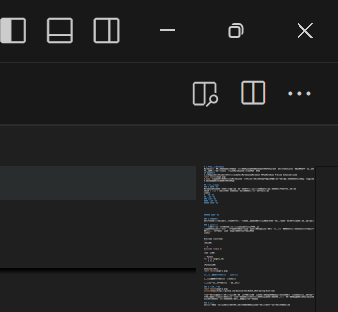
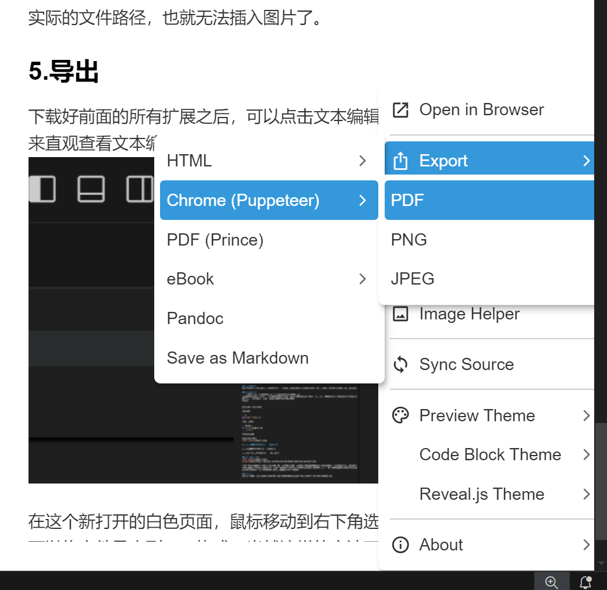
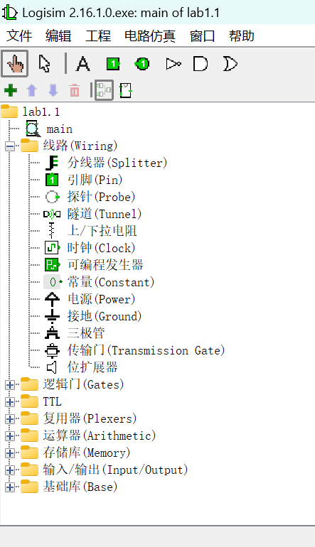
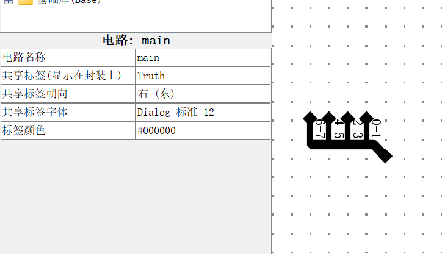
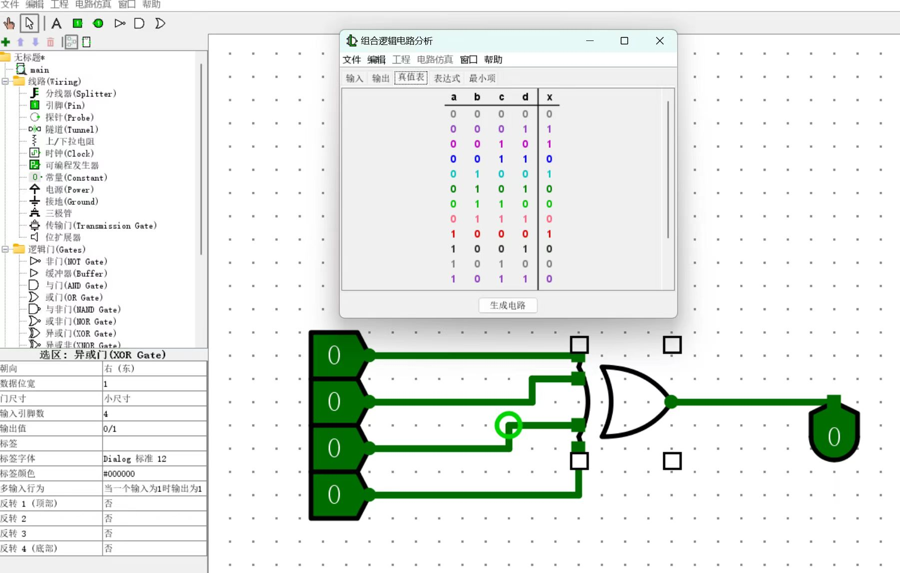
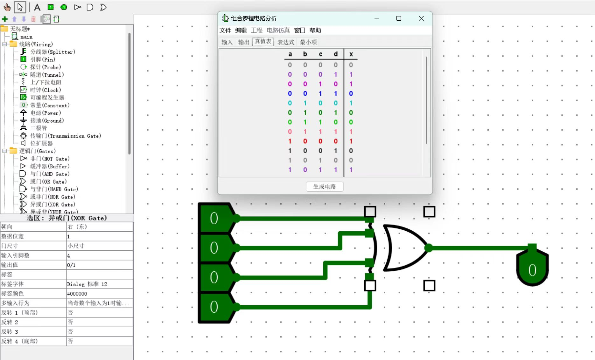

# 学会使用Markdown
Markdown是一种轻量化的文本编辑语言，在撰写对排版要求不高的内容时比word更简洁，且没有Latex一样陡峭的学习曲线。鉴于后续会撰写大量的实验报告，从这学期的数逻计组实验报告开始上手Markdown会是个不错的开端。
## 你需要：
1.在电脑上下载VScode，并且在扩展处下载Markdown、Markdown PDF、Markdown Preview Enhanced扩展。


2.创建一个新的文本文件，选择Markdown语言，并选择路径保存（否则无法快速插入图片，因为文件还没有保存到一个指定的路径下）
3.接下来就可以愉快地书写内容了~

## 基本使用方法
### 1.撰写标题
Markdown拥有六级标题大小，最小的一级标题可以作为对格式要求不严格的论文摘要部分的字体和大小。
输入# + 空格 + <文本内容> 即可输入标题，#数量越多，标题字体越小。
示例：
# 一级标题
## 二级标题
### 三级标题
#### 四级标题
##### 五级标题


###### 六级标题

### 2.编辑文本
文本字体大小是固定的，而且不接受超出一个的换行符。例如，在上面的“五级标题”和“六级标题”之间打了许多换行符，但在显示内容里是看不到的。

### 3.特殊格式
    在文本前打一个TAB（或四个空格）会给文字打上灰色背景
用英文输入法下连续3个“ ` ”字符可以键入程序语言。（在键盘左上角位置，一般和~在一颗键盘内）再次输入3个本字符结束。
如果在第一串字符后加上语言名称，就可以给字符上色。
示例：

```
#include <iostream>
```
(没上色)

```C
#include <stdio.h>
```
(C语言上色)

```Python
for i in range(1,10)
    i += 1
```
(Python上色)

输入示例在这里



**使用双星号包围文本制造加粗效果**

*使用单星号包围文本制造斜体效果*

~使用单波浪线包围文本制造删除线效果~

### 4.链接和图片


[本仓库地址](https://github.com/RainstarYan/NJUCS_2024-Spring-DLCC-lab)

插入图片，只需要在链接格式方括号前面加上叹号，后面加上文件路径。但这样的方式比较繁琐，一般情况下，我们可以将图片复制，然后直接在文本中粘贴。这会直接在你的实验报告路径下创建一个该图片的副本，并且自动填写相对文件路径。这也是为什么前面推荐你先保存markdown文件再编辑的原因，否则新创建的文件未经保存，还没有一个实际的文件路径，也就无法插入图片了。

### 5.导出
下载好前面的所有扩展之后，可以点击文本编辑页面右上角的放大镜，来直观查看文本编辑效果。



在这个新打开的白色页面，鼠标移动到右下角选择如图所示的选项，就可以将文件导出到PDF格式。当然这样的方法不唯一，你也可以选择其他的扩展和格式转换方法。




# Logisim功能入门
当你打开一个Logisim文件后，可以看到类似的界面，我们将目光聚焦到左上角。



其中的大部分功能会在实验手册中提及，这里着重介绍一些实验手册中没讲过或一笔带过但很有用的技巧。

## 线路篇
分线器可以将多个线路合并到一起，或将一个多位数据拆分成多个线路的更小单位数据，它的页面大致如下



你可以通过改变朝向来改变分线器的朝向。分线端口数小于等于位宽，意味着有些时候你不需要将32位的数据拆成32个一位数据来计算，这非常麻烦。例如上图给出了一个8位位宽，但只有4个端口，每个端口对应两位数据的分线器。你也可以改变分线器的外观，通常“中心式”外观更好看且不占地方。

隧道是另一个常用的线路模块，它可以跨空间地、不经过线路直接连接的方式将信号传导，更有利于你的构图需要。同名的隧道映射同一个输入。

在中后期的实验内容中，往往需要对时钟引脚反复点击。你可以通过设置线路中时钟的方式取代鼠标多次点击（这样很费手）

在部分位操作实验中，你可能需要大规模的位扩展操作。如果腻了常量连接一串分线器的构建思路，你可以选择使用位扩展器这一模块来完成你想做的操作。

## 逻辑门篇
逻辑门的功能大多比较易懂，但异或门需要格外注意。在输入多于两个时，异或门有两种运行方式：当奇数输入有效时输出1，或只有1个输入有效才输出1.这部分在前面实验报告中有所涉及。


只有1个输入1时输出1


奇数输入为1时输出1

其余的部分会在实验说明中慢慢提及，慢慢掌握即可。
